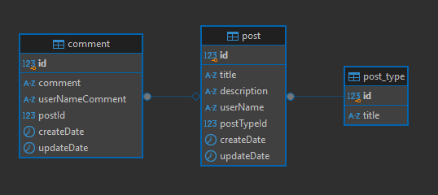

# Board app server

## ขั้นตอนการติดตั้ง
```
1. Clone repository
2. ติดตั้ง package โดยใช้คำสั่ง npm install
3. สร้างไฟล์ .env.development (env ตัวอย่างจะอยู่ในไฟล์ .env.example)
4. สร้างฐานข้อมูล PostgreSQL โดยใช้คำสั่ง docker-compose up -d
5. Migration script เพื่อเพิ่ม master data โดยใช้คำสั่ง npx typeorm migration:run --dataSource dist/data-source.js
6. npm run start:dev
```

## การออกแบบสถาปัตยกรรมของแอปพลิเคชัน
 **ภาพรวม**
```
ประกอบด้วย 3 ส่วน:
Frontend: Next.js ใช้สำหรับแสดง UI
Backend: ใช้ Nestjs สำหรับสร้าง service และเชื่อมต่อฐานข้อมูล
Database: ใช้ฐานข้อมูล PostgreSQL
```

**การออกแบบฐานข้อมูล**




```
Posts Table:
- id: Primary Key
- title: ชื่อ Blog
- description: เนื้อหา Blog
- userName: username ของ user
- createdDate: วันที่สร้าง
- updatedDate: วันที่แก้ไขล่าสุด
- postTypeId: Foreign Key (เชื่อมกับ PostType)

Comments Table:
- id: Primary Key
- comment: เนื้อหาความคิดเห็น
- userNameComment: username ของ user
- createdDate: วันที่แสดงความคิดเห็น
- updatedDate: วันที่แก้ไขความคิดเห็น
- postId: Foreign Key (เชื่อมกับ Post)

PostType Table:
- id: Primary Key
- title: ชื่อประเภทของ blog
```

**API Flow**
```
Dashboard Home:
- ส่งคำขอ GET ไปที่ API /posts เพื่อดึงรายการโพสต์ทั้งหมด
- ส่งคำขอ GET ไปที่ API /posts?keyword=?postTypeId= เพื่อดึงรายการค้นหาด้วย keyword และ postTypeId
- ส่งคำขอ GET ไปที่ API /posts?id= เพื่อดึงรายการ Blog by id
- ส่งคำขอ POST ไปที่ /posts เพื่อสร้าง Blog

Dashboard Our Blog:
- ส่งคำขอ PATCH ไปที่ /posts,{id} เพื่อแก้ไข Blog
- ส่งคำขอ DELETE ไปที่ /posts?id,{userName} เพื่อลบ Blog

ฺBlog Detail:
- ส่งคำขอ POST ไปที่ /posts/comment,{comment, userName, postId} เพื่อสร้าง Comment
```


## libraries/packages
```
1. pg: เชื่อมต่อและจัดการฐานข้อมูล PostgreSQL
2. typeorm: สร้างและจัดการ entities ในฐานข้อมูล
3. cross-env: เพื่อกำหนดค่า environment
4. class-validator: ตรวจสอบความถูกต้องของข้อมูลใน class
6. moment: สำหรับจัดการวันที่และเวลา
```
